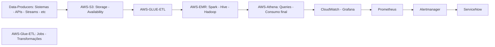

# Arquitetura de Monitoramento – Data Lake AWS

```mermaid
flowchart LR
    Data-Producers[" Data-Producers: Sistemas - APIs - Streams - etc"]
    AWS-S3["AWS-S3: Storage - Availability"]
    AWS-Glue-ETL["AWS-Glue-ETL: Jobs - Transformações"]
    AWS-EMR["AWS-EMR: Spark - Hive - Hadoop"]
    AWS-Athena["AWS-Athena: Queries - Consumo final"]
    Observabilidade-CloudWatch+Grafana["CloudWatch - Grafana"]
    Prometheus["Prometheus"]
    Alertmanager["Alertmanager"]
    ServiceNow["ServiceNow"]

    Data-Producers --> AWS-S3 --> AWS-GLUE-ETL --> AWS-EMR --> AWS-Athena --> Observabilidade-CloudWatch+Grafana
    Observabilidade-CloudWatch+Grafana --> Prometheus --> Alertmanager --> ServiceNow
```