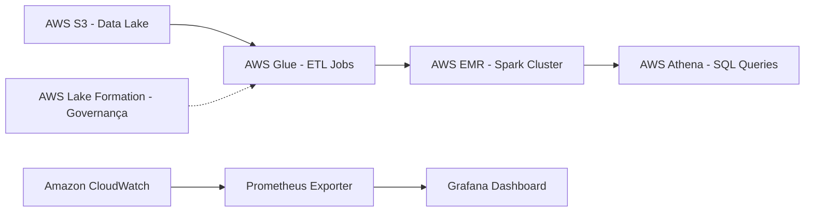

# Visão da Arquitetura

```mermaid
flowchart LR
    S3["AWS S3 - Data Lake"]
    Glue["AWS Glue - ETL Jobs"]
    EMR["AWS EMR - Spark Cluster"]
    Athena["AWS Athena - SQL Queries"]
    Lake["AWS Lake Formation - Governança"]
    CW["Amazon CloudWatch"]
    Prom["Prometheus Exporter"]
    Grafana["Grafana Dashboard"]

    S3 --> Glue --> EMR --> Athena
    Lake -.-> Glue
    CW --> Prom --> Grafana
```
    