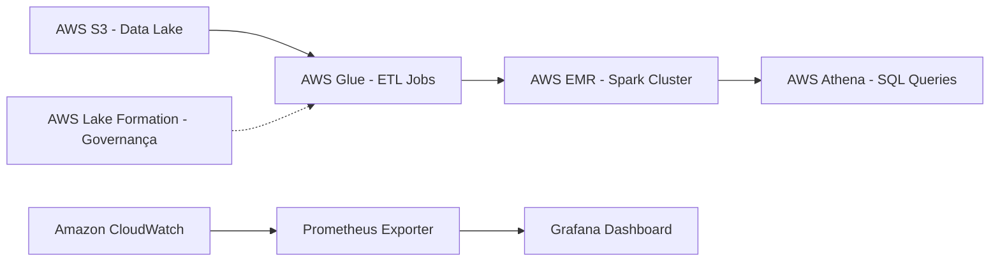

# Visão da Arquitetura



```mermaid
flowchart LR
    Data Producers ["(Sistemas, APIs, Streams, etc.)"]
    AWS S3 (Raw) ["Storage / Availability"]
    AWS Glue ETL ["Jobs / Transformações"]
    AWS EMR (Processing) ["Spark / Hive / Hadoop"]
    AWS Athena (Consulta) ["Queries / Consumo final"]
    Observabilidade: CloudWatch + Grafana ["Prometheus / Alertmanager / ServiceNow"]
    Prometheus ["Prometheus"]
    Alertmanager ["Alertmanager"]
    ServiceNow ["ServiceNow"]

    Data Producers --> AWS S3 (Raw) --> AWS Glue ETL --> AWS EMR (Processing) --> AWS Athena (Consulta) --> Observabilidade
    Observabilidade --> Prometheus --> Alertmanager --> ServiceNow
```